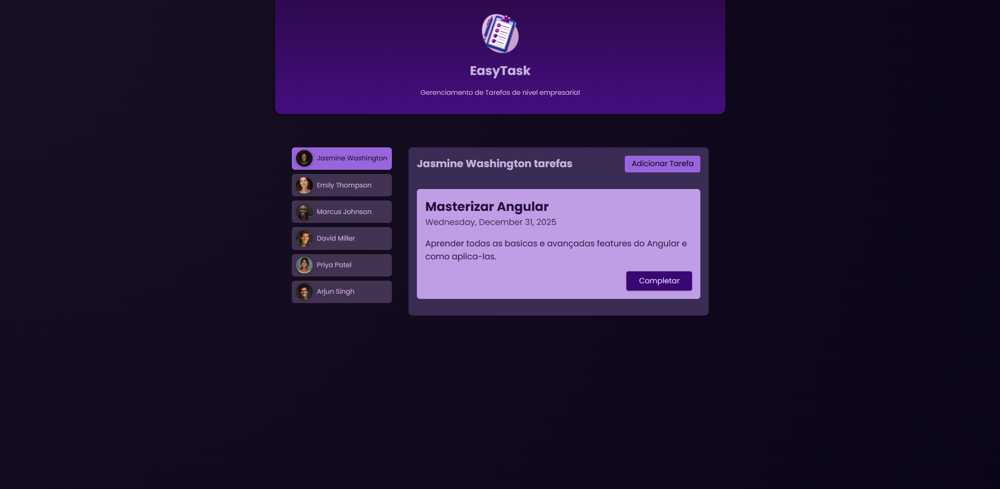

<h1>EasyTask</h1>
<p>EasyTask é uma aplicação web para gerenciamento de tarefas, construída com Angular. Este projeto de estudo foi desenvolvido com o objetivo de ajudar usuários de uma empresa ficticia a planejar, monitorar e concluir tarefas de maneira eficiente.</p>

<h2>Funcionalidades</h2>
<ul>
    <li>Interface Simples e Intuitiva: Design minimalista para facilitar o uso.</li>
    <li>Gerenciamento de Tarefas: Criação, remoção e marcação de tarefas como concluídas.</li>
    <li>Organização por Funcionarios: Permite agrupar tarefas por categorias para melhor visualização.</li>
</ul>

<h2>Captura de Tela</h2>



<h2>Tecnologias Utilizadas</h2>
<ul>
    <li>Framework: Angular</li>
    <li>Linguagem: TypeScript</li>
</ul>

<h2>Pré-Requisitos</h2>

<ul>
    <li>Node.js (recomendado LTS)</li>
    <li>Angular CLI</li>
</ul>

<h2>Instalação</h2>

- Execute no terminal

```sh
git clone https://github.com/AkiroSetonai/EasyTask.git
```

- Acesse o Diretório do Projeto:

```sh
cd EasyTask

```

- Instale as dependências:

```sh
npm install

```

<h2>Desenvolvimento</h2>

- Inicie o servidor:

```sh
ng serve

```

- Acesse a Aplicação

<p>Abra seu navegador e vá para http://localhost:4200/</p>
